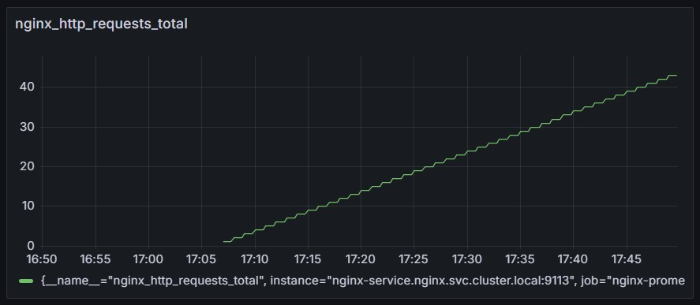

# Итоговая аттестация. Задание 6

Торшин Сергей

## Запуск

0. Загрузить и перейти в директорию репозитория:
    ```
    git clone https://github.com/torshin5ergey/1tdata-do_2024-08-28_6.11-06.git

    cd 1tdata-do_2024-08-28_6.11-06
    ```
1. Установить NGINX:
    ```
    kubectl apply -f nginx/namespace.yaml
    kubectl apply -f nginx/
    ```
    Переадресовать порты NGINX и nginx_prometheus_exporter с помощью `kubectl`:
    ```
    kubectl -n nginx port-forward svc/nginx-service 8080:80 9113:9113
    ```
2. Установить Prometheus:
    ```
    prometheus/install_prometheus_helm.sh
    ```
    Переадресовать порт Prometheus с помощью `kubectl`:
    ```
    kubectl -n monitoring port-forward svc/prometheus-server 9090:80
    ```
3. Установить Grafana:
    ```
    grafana/install_grafana_helm.sh
    ```
    Получить пароль Grafana для пользователя `admin`:
    ```
    kubectl get secret --namespace grafana grafana -o jsonpath="{.data.admin-password}" | base64 --decode ; echo
    ```
    Переадресовать порт Grafana с помощью `kubectl`:
    ```
    kubectl -n grafana port-forward svc/grafana 3000:80
    ```
4. Проверить доступность ресурсов:

    NGINX: `http://localhost:8080`

    Nginx HTTP Stub Status: `http://localhost:8080/status`

    Nginx Prometheus Exporter: `http://localhost:9113`
    
    Prometheus: `http://localhost:9090` 

    Grafana: `http://localhost:3000`
5. Настроить визуализацию метрики nginx_http_requests_total в Grafana:

    Логин в Grafana и создать источник данных:
    Prometheus: Prometheus server URL `http://prometheus-server.monitoring.svc.cluster.local:80`
    Создать дашборд и добавить визуализацию:
    Source: Prometheus, metric: nginx_http_requests_total
    


## Стек

- Kubernetes
- Helm
- [NGINX](https://nginx.org/en/)
- [ngx_http_stub_status_module](https://nginx.org/en/docs/http/ngx_http_stub_status_module.html)
- [NGINX Prometheus Exporter](https://github.com/nginxinc/nginx-prometheus-exporter)
- [Prometheus Community Kubernetes Helm Charts](https://github.com/prometheus-community/helm-charts)
- [Grafana Community Kubernetes Helm Charts](https://github.com/grafana/helm-charts)
